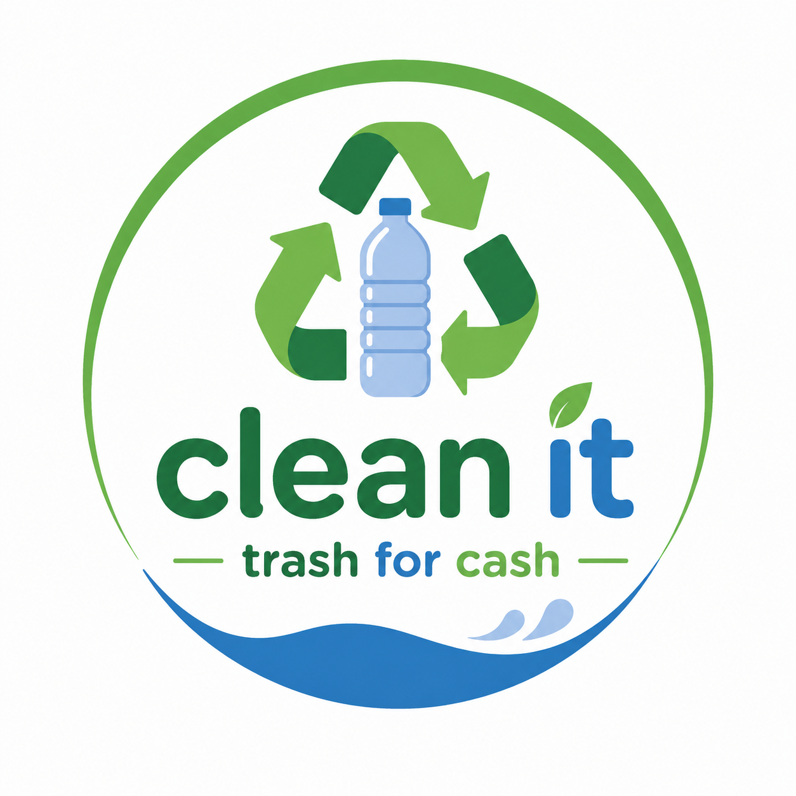

<p align="center">
  
</p>

<h1 align="center">cleanit</h1>

<p align="center">trash for cash · winnipeg</p>

---

cleanit is a mobile app that gets people in winnipeg to actually recycle by making it worth something. you point your camera at an item, the app tells you what it is and where it goes, then points you to the closest drop-off. dropping it off earns you points, and points turn into real rewards from local businesses.

the idea started as a project at a canu / kahanee design lab and was later developed at shad. it has since received over $2.5k in funding and has been presented to the mayor of winnipeg.

## why

winnipeg has recycling infrastructure. what it doesn't have is a reason for most people to go out of their way to use it. sorting rules are confusing, depot hours are inconsistent, and there's no payoff for getting it right. cleanit closes that gap by removing the guesswork and adding an incentive on the other end.

the app is also built around wahkohtowin, the cree understanding that all living things are related and that relatedness carries responsibility. it operates on treaty 1 territory, and the about screen says so directly.

## what it does

**scan** – camera view with a scan frame, torch toggle, and a result sheet that identifies the item, its category, and the points it's worth. the result card includes a mini map showing you and your nearest bin, plus walk time.

**map** – a full leaflet map of winnipeg with 160+ locations. five real recycling depots with hours, phone numbers, and what they accept, plus recycling bins and general waste points. filters for depots, recycling, and general waste, with a legend and a locate-me button.

**rewards** – points, streaks, city rank, and four tiers (eco starter, warrior, champion, legend) with an animated progress ring. eight local partner rewards from prairie donuts and the forks up to blue bombers tickets and a thermea day pass. daily challenges on top.

**home** – impact dashboard, recent activity feed, active challenges, and a short walkthrough of how the loop works.

**about** – mission, the wahkohtowin section, and the treaty acknowledgment.

## stack

- react native 0.81 with expo sdk 54
- react navigation (native stack + bottom tabs, custom tab bar)
- expo-camera for scanning, expo-location for positioning
- leaflet inside a react-native-webview for both maps, with carto light basemap tiles
- react-native-reanimated and the animated api for transitions
- react-native-svg for the tier ring, react-native-confetti-cannon for reward moments
- dm serif display and plus jakarta sans via @expo-google-fonts

## structure

```
App.js                  font loading, safe area, entry point
index.js                expo root registration
app.json                expo config, permissions, icons
assets/                 logo, app icons, splash
src/
  navigation/
    AppNavigator.js     tab navigator + modal stack for scan and about
  screens/
    HomeScreen.js       dashboard, activity, challenges
    ScanScreen.js       camera, scan frame, result sheet, mini map
    MapScreen.js        full winnipeg map with filters
    RewardsScreen.js    tiers, partners, challenges
    AboutScreen.js      mission, wahkohtowin, treaty acknowledgment
  components/
    CustomTabBar.js     tab bar with the raised scan button
    MapHtml.js          the leaflet map, built as an html string
    ItemIcon.js         maps item names to icons and colors
    ConfettiCannon.js   reward animation
  theme/
    colors.js           winnipeg green, blue, and red palette
    typography.js       font aliases
```

## running it

you need node and the expo go app on your phone.

```bash
git clone https://github.com/huznot/CleanIt.git
cd CleanIt
npm install
npx expo start
```

scan the qr code with expo go, or press `i` / `a` to open a simulator.

```bash
npm run ios       # ios simulator
npm run android   # android emulator
npm run web       # browser, though camera and location are limited
```

the app asks for camera access on the scan screen and location on the map. both are optional in the sense that the app won't crash without them, but the map defaults to a city-wide view and the nearest-bin logic falls back to a static pick.

## current state

the ui and the full user flow are done. item recognition is stubbed right now, so a scan returns a fixed result while the classifier is being worked on. the five depots on the map are real winnipeg locations with real hours and numbers. the surrounding bin markers are generated from a fixed seed to show density and are placeholders until the city dataset is wired in.

next up is the actual classification model, real bin data from the city, and account state so points persist instead of living in component state.

## license

mit. see [LICENSE](LICENSE).
